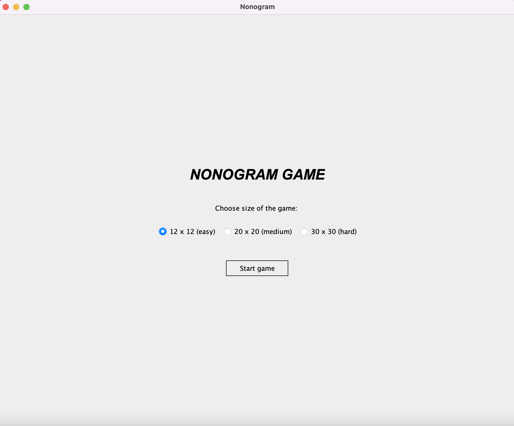
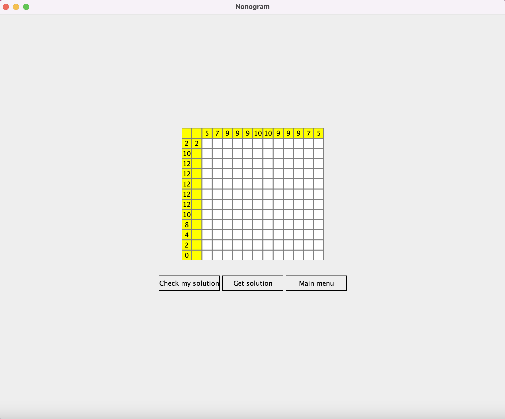
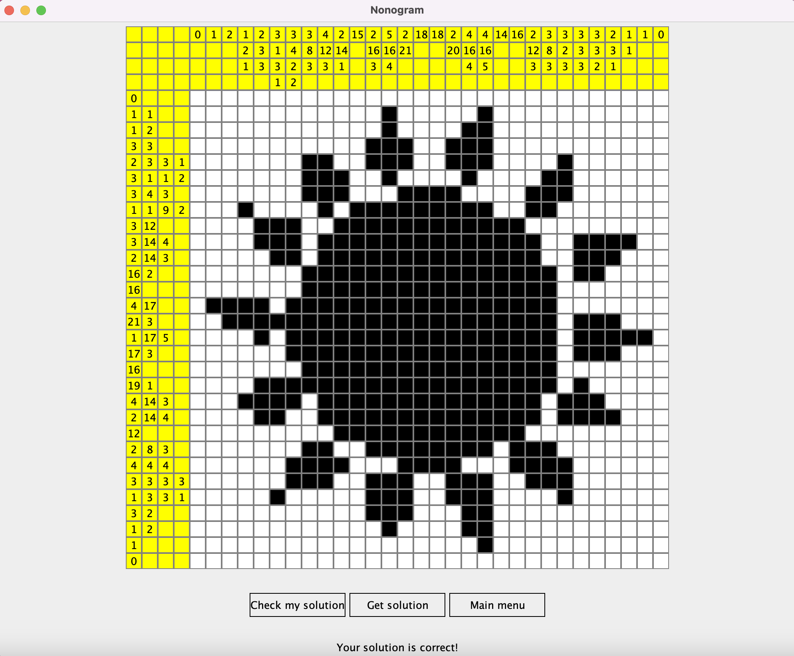

# Nonogram-game
"This is a nonogram game developed using the nonogram generator module, which you can find here: https://github.com/Vanja-Maric/Nonogram-generator."

Start page:
 

Game: 

 

## [How to play the game](./endUser.md)
## [Use the Nonogram generator module, or continue its development](https://github.com/Vanja-Maric/Nonogram-generator)
## [How to Contribute](./contribute.md)
## [Tests](./testing)
## [Examination](./reflection.md)
