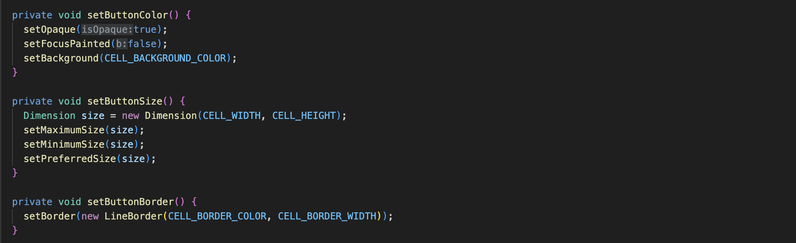
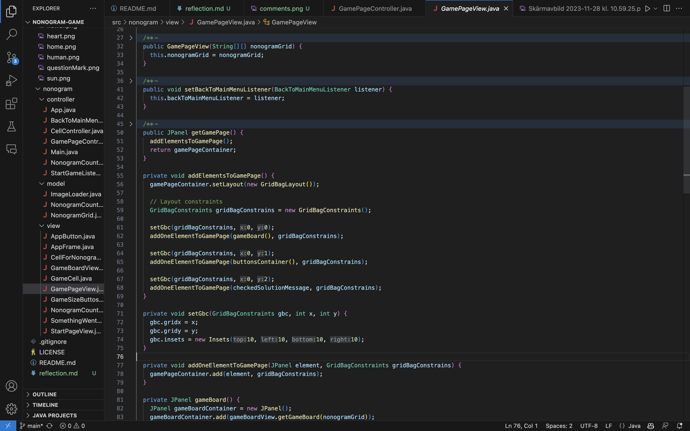
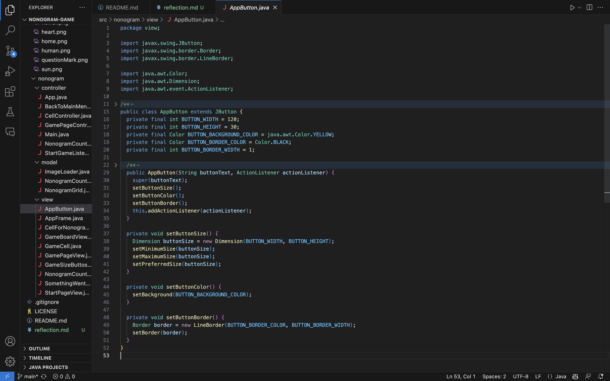
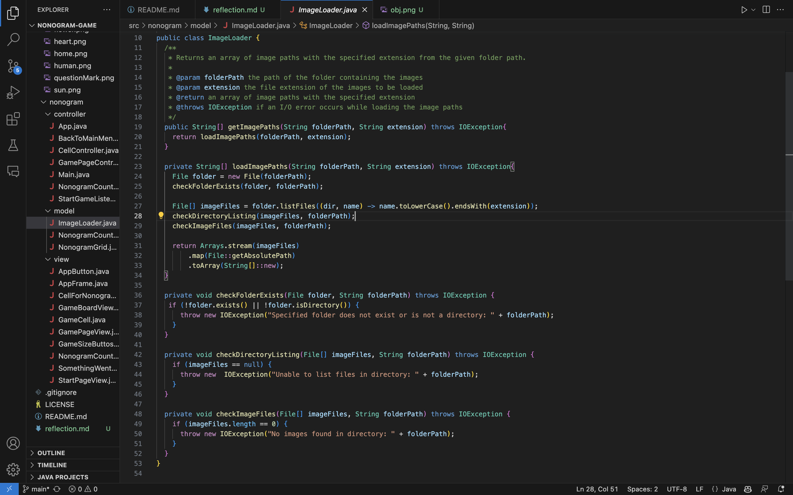
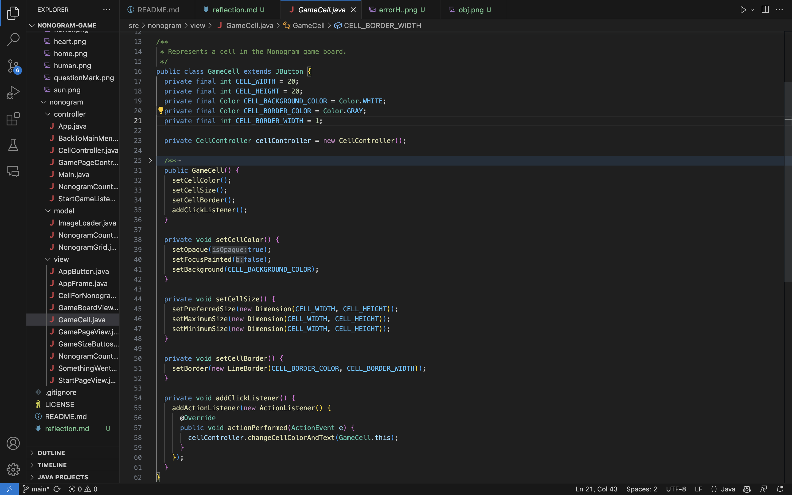

# Reflection

## Chapter 2 - The Impact of "Meaningful Names on My Code"

```
  private ArrayList<JButton> createOneRowOfGameCells(String[] oneRowOfNonogramGrid) {
    ArrayList<JButton> gameCellsInOneRow = new ArrayList<>();

    for (int cell = 0; cell < oneRowOfNonogramGrid.length; cell++) {
      JButton gameCell = createGameCell();
      gameCellsInOneRow.add(gameCell);
    }
    addGameCellsToList(gameCellsInOneRow);

    return gameCellsInOneRow;
  }
  ```

In this chapter, I delve into the significant influence that adopting meaningful names has had on my coding practices, as exemplified in my function createOneRowOfGameCells. Here, I used clear and descriptive names like gameCellsInOneRow and the parameter oneRowOfNonogramGrid, which made the code self-explanatory and aligned with the principles from Chapter 2, thus reducing the need for additional explanatory comments. This shift led me to start assigning meaningful names to my variables, functions, and classes, streamlining my code and making it more self-explanatory.


## Chapter 3 - Impact of "Functions" on my code


The most profound impact that Chapter 3 had on my coding approach is my transition to writing small, concise functions, each no longer than 20 lines, dedicated to performing a single task. An example of this can be seen in my function applySolutionToBoard, where the function clearly focuses on applying a solution to the board, iterating through the nonogramGrid and updating the gameBoardCells accordingly. Additionally, I've created a separate function, applyColorToCell, which is solely responsible for changing the color of a cell. This approach contrasts sharply with my earlier practice of writing lengthy, multifunctional functions. Previously, I would have combined these tasks into one large function handling multiple responsibilities. Now, each function is streamlined, focusing on one specific task, and is free from side effects, significantly enhancing the readability and maintainability of my code.


## Chapter 4 - Impact of "Comments" on my code

This chapter profoundly influenced my coding style, leading me to significantly reduce the number of comments in my code, especially those that are redundant or merely informative. I've also started incorporating more warning comments, recognizing their importance in documenting potential pitfalls for other programmers who might work on the code, or even for myself. These warnings are crucial as it's easy to forget certain nuances, and there's always a chance I might not recall specific details when revisiting the code after several months.

Additionally, I've come to realize that some Javadoc comments are unnecessary, particularly for well-written and clear functions. This realization is aptly demonstrated in the following example, where the code's clarity and structure make extensive documentation superfluous. This shift towards more meaningful commenting has not only streamlined my code but also enhanced its readability and maintainability.



## Chapter 5 - Impact of "Formatting" on my code

This chapter emphasized the importance of structuring code logically, with details increasing as one moves down the source file. Initially, I didn't prioritize how functions were ordered within a class as long as I could navigate through them. However, I've now realized the significant impact of arranging functions in a logical sequence, akin to reading a book or newspaper. By implementing the principle that “Detail should increase as we move downward,” and ensuring that dependent functions are vertically close, with the caller above the callee whenever possible, I've greatly enhanced the readability and flow of my code.

In my example code for GamePageView, this approach is evident. I've structured the functions in a way that reflects their interdependencies and logical sequence. The constructor initializes the essential data, followed by the function setBackToMainMenuListener. Then, the pgetGamePage function, which assembles the game page, is placed above the addElementsToGamePage function that it calls. This ordering not only makes it easier to follow the flow of the program but also reduces the need for unnecessary comments or spacing. It's a practice that has made my code more intuitive and efficient to navigate, staying true to the chapter's guidance.

 


## Chapter 6 - Objects and data structures

From this chapter, I've gleaned vital insights about the distinct characteristics of objects and data structures in programming. Objects, by exposing behavior and hiding data, simplify the addition of new object types without necessitating changes in existing behaviors. However, this approach can complicate adding new behaviors to existing objects. On the flip side, data structures are more about exposing data without significant behavior, making it straightforward to introduce new behaviors to existing structures but challenging to add new data structures to existing functions.

his concept is illustrated in my AppButton class example, which exemplifies object-oriented principles through encapsulation of behavior and data. In this class, the constructor public AppButton(String buttonText, ActionListener actionListener) is the primary exposed method, providing an interface for interaction with the AppButton object. The internal workings, such as setting the button's size, color, and border, are handled by private methods setButtonSize, setButtonColor, and setButtonBorder.
 


## Chapter 7 - Impact of "Error handling" on my code

In the chapter on error handling, I learned several key principles for effective and user-friendly error management in code. First and foremost, I understood the importance of not exposing users to raw error messages, which can be confusing and unhelpful. Instead, providing a generic error message enhances user experience by keeping the underlying issue abstract.
I also learned that returning null can create more problems, leading to additional checks and potentially causing the application to fail if a null check is missed. This reinforced the idea that handling potential errors proactively is crucial.

IIn my ImageLoader class, I chose to use a generic IOException for various errors. Since each error would be resolved in the same manner and by displaying the same user-friendly message, there was no need to create different exception classes for each error type. 

 


## Chapter 8 - Impact of "Boundaries" on my code

From the "Boundaries" chapter, I discovered the value of learning tests. These tests aren't just beneficial; they're essentially free knowledge. By writing learning tests, I can understand how the third-party code behaves, and these tests serve as a safety net for future updates to the third-party packages. This is a shift from my earlier approach, where I concentrated solely on the present functionality of my code without considering future adaptability. The realization of learning tests' importance has changed my perspective, underscoring the need to anticipate and prepare for potential changes in external code that my project depends on. 


## Chapter 9 - Impact of "Unit tests" on my code

Before encountering Chapter 9, my coding journey was primarily focused on honing my coding techniques in specific programming languages, leaving little room for writing automated tests. In fact, I had only written one automated test so far, largely because my approach had been more about perfecting the craft of coding itself. However, after over a year of learning to program, I've come to realize the importance of shifting towards writing more automated tests and relying less on manual testing.

Reading this chapter made me aware of the significance of clean code in testing. Previously, in the test application I used for manual testing of my nonogram module, I admit I wrote code haphazardly and it was far from clean, done intentionally to save time. But now, recognizing that the cleanliness and quality of test code are crucial for the sustainable development of applications, I've dedicated myself to refactoring and properly structuring my test application code. This new perspective has not only improved the quality of my tests but also contributed to my overall growth as a programmer, making me more adept at creating robust and reliable software.


## Chapter 10 - Impact of "Classes" on my code
From the chapter on classes, I learned the vital importance of the Single Responsibility Principle (SRP) in class design. SRP advocates for classes to have a singular focus, stating that each class should encapsulate only one responsibility and have only one reason to change. This principle is crucial because, in the process of making software work, we often conflate functionality with clarity and organization, usually focusing more on the former. However, maintaining a separation of concerns is as important in our programming activities as it is in our code itself.

In my coding practice, this principle is demonstrated in the way I structured the GameCell class for a Nonogram game board. Instead of incorporating cell creation within the game board class, which would have overloaded it with multiple responsibilities, I created a separate GameCell class. This class is solely responsible for defining the properties and behaviors of a game cell, like setting its color, size, border, and adding a click listener. By delegating the responsibility of cell creation and management to this dedicated class, I adhered to SRP, making my code cleaner, more organized, and easier to maintain.

 


## Chapter 10 - Impact of "Systems" on my code
I embraced the concept that systems cannot be perfect from the start. Instead of striving for initial perfection, I now focus on implementing current requirements and then refactoring and expanding the system for new needs. This iterative and agile methodology has eased my concerns about not being good enough initially, as it's a normal part of the development process.

Additionally, I've learned the value of delaying decisions until necessary, which allows for making more informed choices with the best available information. This approach, combined with the principle of using the simplest possible solution, has guided me to design more efficient and adaptable systems and modules, leading to overall better software design.


